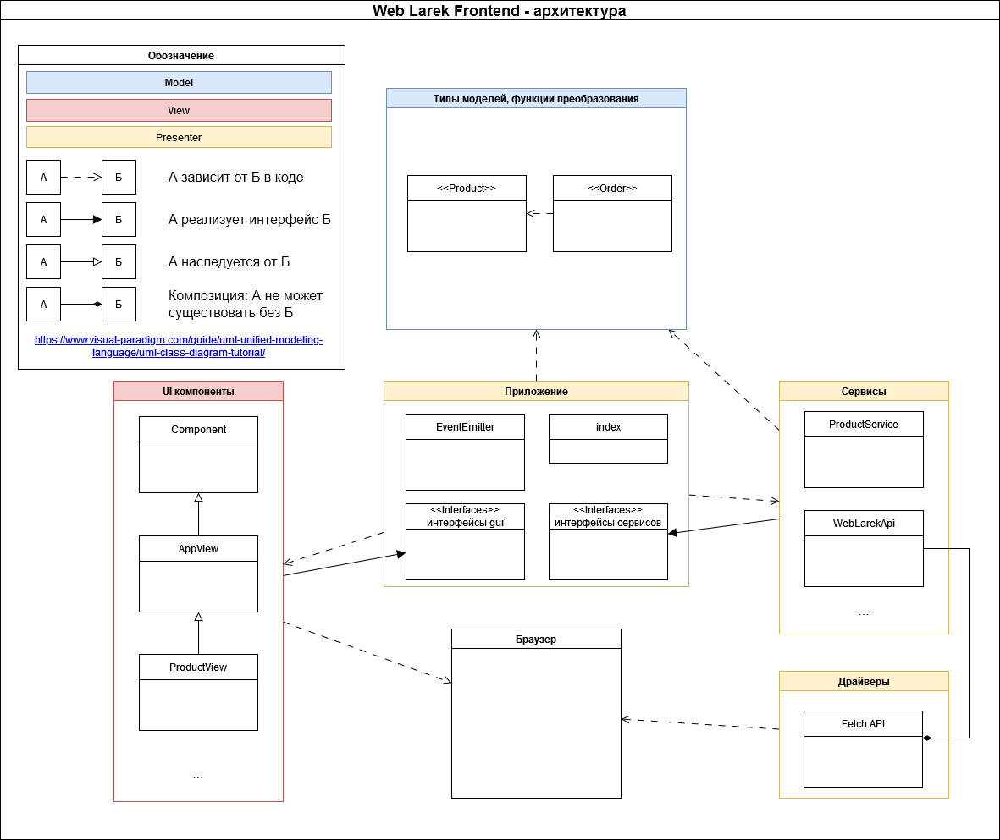
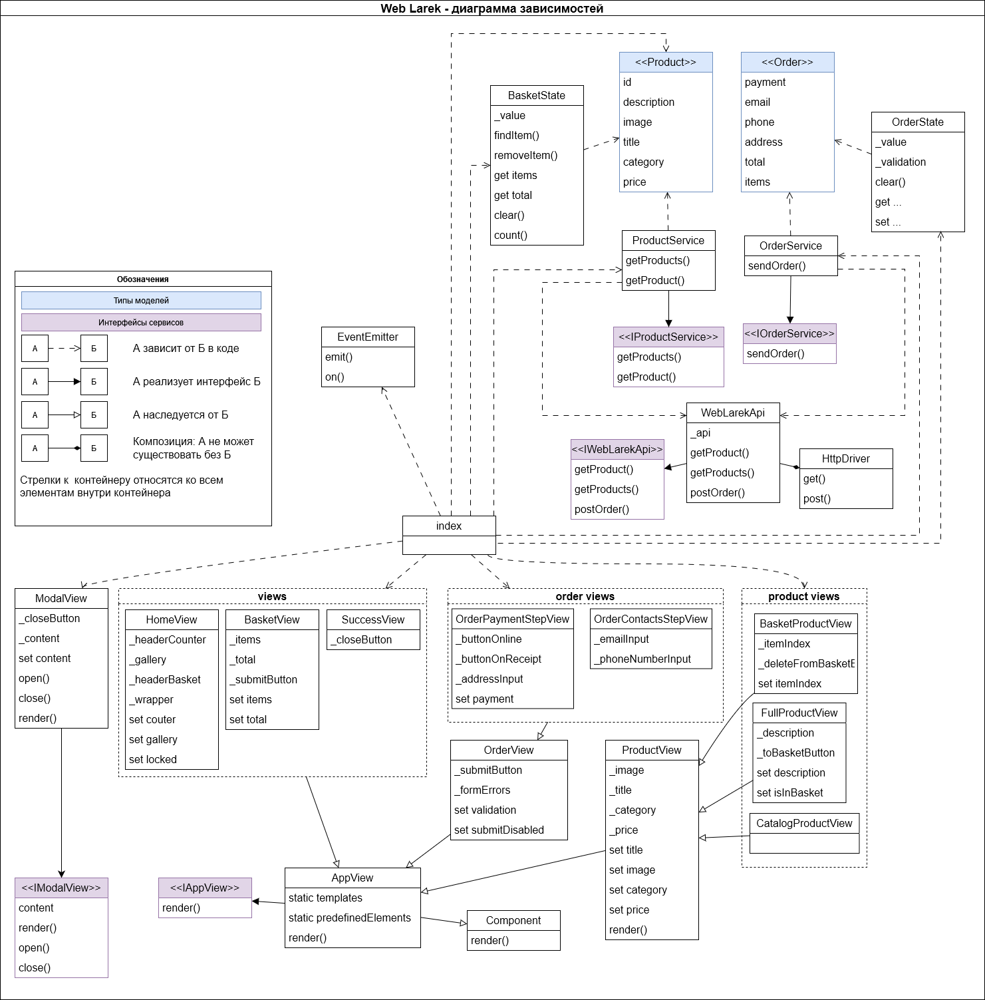

# Яндекс.Практикум: Проектная работа "Веб-ларек"

Стек: HTML, SCSS, TypeScript, Webpack

Структура проекта:

- src/ — исходные файлы проекта, модули слоя приложения
- src/common.blocks/ - файлы стилей для блоков
- src/images/ - изображения
- src/pages/ - файлы html
- src/public/ - файлы, необходимые для сборки приложения
- src/scss/ - общие файлы стилей
- src/vendor/ - сторонние пакеты
- src/js - исходные файлы TypeScript
- src/js/drivers/ - модули слоя драйверов - API браузера
- src/js/app/ - файлы и модули слоя приложения
- src/js/models/ - модули для типов, функций и классов обработки моделей
- src/js/services/ - модули слоя сервисов
- src/js/ui/ - общие компоненты UI
- src/jd/utils/ - вспомогательные функции и классы
- src/js/views/ — UI компоненты приложения
- src/js/types/ - типы, используемые приложением

Важные файлы:

- src/pages/index.html — HTML-файл главной страницы
- src/styles/styles.scss — корневой файл стилей
- src/index.ts — точка входа приложения

## Установка и запуск

Для установки и запуска проекта необходимо выполнить команды

```
npm install
npm run start
```

или

```
yarn
yarn start
```

## Окружение

Для правильной сборки проекта необходимо задать переменную окружения `API_ORIGIN`

## Сборка

```
npm run build
```

или

```
yarn build
```

## Архитектура
### Модели

Данный слой не зависит ни от каких частей приложения.
Описывает модели данных и процедуры их преобразования
#### Товар

```typescript
type Product = {
	id: ProductId;
	description: string;
	image: string;
	title: string;
	category: string;
	price: number | null;
};
```

#### Заказ

```typescript
type Order = {
	payment: 'card' | 'cash';
	email: string;
	phone: string;
	address: string;
	total: number;
	items: Product[];
};
```

### Приложение (прикладной слой)

Модули и классы прикладного слоя могут использовать слой моделей и сервисный слой (сервисы и UI-компоненты приложения)
Здесь происходит инициализация брокера событий, создание сервисов и UI-компонентов, начальная инициализация приложения; описываются требуемые для приложения интерфейсы взаимодействия с внешним миром
#### Брокер событий

Обеспечивает работу событий. Его функции: возможность установить и снять слушателей событий, вызвать слушателей при возникновении события

```typescript
class EventEmitter<E extends string | '*' | RegExp> {
	on<T>(eventName: E, callback: (event: T) => void): void;
	off(eventName: E, callback: Subscriber): void
	emit<T>(eventName: Exclude<E, RegExp>, data?: T): void;
}
```

#### Тип "События приложения"

Предназначен для типизации брокера событий. Передается в переменную типа его конструктора

```typescript
export type AppEvents =
	| 'START'
	| 'CARD_SELECT'
	| 'CARD_TOGGLE_BASKET'
	// ...
	;

const events = new EventEmitter<AppEvents>();
```
#### Основной модуль приложения

Может зависеть от модулей следующих слоев: модели, сервисы и UI-компоненты. Не зависит от API браузера.

`index.ts`

- точка входа в приложение
- создание сервисов и UI-компонентов приложения
- добавление событий в `EventEmitter` и подключение их обработчиков
- запуск получения товаров с сервера и заполнение компонента начальной страницы

#### Интерфейсы взаимодействия с внешним миром (_порты_)

Эти интерфейсы - часть приложения.
Сервисы, которые будет использовать приложение, должны реализовать эти интерфейсы. Таким образом мы сможем при необходимости заменить их без изменения самого приложения

```typescript
// ports.ts

interface IProductService {
	getProducts: () => Promise<Product[]>;
	getProduct: (id: ProductId) => Promise<Product>;
}

interface IOrderService {
	sendOrder: (order: Order) => Promise<SentOrder>;
}

interface IWebLarekApi {
	getProducts: () => Promise<Product[]>;
	getProduct: (id: ProductId) => Promise<Product>;
	postOrder: (order: Order) => Promise<SentOrder>;
}
```

#### Интерфейсы UI-компонентов

Эти интерфейсы - часть приложения.
Компоненты, которые будет вызывать приложение, должны соответствовать этим интерфейсам.
В переменной типа с именем `H` задается тип, который возвращает UI-компонент при выполнении метода `render`

```typescript
interface IModalView<H> {
	content: H;
	render: (data: { content: H }) => H;
	open: () => void;
	close: () => void;
}

interface IAppView<T, H> {
	render: (data?: Partial<T>) => H;
}
```

### Сервисы

Классы для взаимодействия приложения с внешним миром.
Реализуют вышеуказанные интерфейсы-"порты"

#### Сервис "Заказ"

Назначение - отправить заказ через API "Web Larek"

```typescript
class OrderService implements IOrderService {
	sendOrder: (order: Order) => Promise<SentOrder>;
}
```

#### Сервис "Товар"

Назначение - получение товаров через API "Web Larek"

```typescript
class ProductService implements IProductService {
	getProducts: () => Promise<Product[]>;
	getProduct: (id: ProductId) => Promise<Product>;
}
```

#### Сервис "API сервера Web Larek"

Назначение - взаимодействие с сервером

```typescript
class WebLarekApi implements IWebLarekApi {
	getProducts: () => Promise<Product[]>;
	getProduct: (id: ProductId) => Promise<Product>;
	postOrder: (order: Order) => Promise<SentOrder>;
}
```

### UI-компоненты

#### Базовый компонент

Не зависит от приложения.
Предоставляет метод `render`, который вызывает соответствующие переданному аргументу сеттеры дочернего компонента

```typescript
abstract class Component<T> {
	render(data?: Partial<T>): HTMLElement;
}
```

#### Базовый компонент для компонентов приложения

Дает доступ к предопределенным элементам разметки `index.html` (templates, predefinedElements). Эти элементы можно использовать в наследуемых компонентах

```typescript
abstract class AppView<T> extends Component<T> implements IAppView<T, HTMLElement> {
	static templates;
	static predefinedElements;
}
```

#### Компоненты приложения

Наследуются от `AppView`

`ModalView` - компонент для отображения модального окна
`SuccessView` - компонент для отображения окна успешной отправки заказа
##### Компонент "Домашняя страница"

`HomeView`

Отображает список товаров в виде карточек. При клике на карточку открывается карточка предварительного просмотра информации о товаре

##### Компонент "Карточка товара"

`ProductView`

Имеет три варианта
- Карточка в списке на домашней странице - `CatalogProductView`
  При клике на карточку открывается предварительный просмотр полной информации о товаре
- Предварительный просмотр информации о товаре - `FullProductView`
  Здесь можно добавить товар в корзину, если он не бесценен
- Элемент списка товаров в корзине - `BasketProductView`
  Есть возможность удалить этот товар из корзины

##### Компонент "Корзина"

`BasketView`

Отображает список добавленных товаров, их цены, общую сумму; предоставляет возможность удаления товара из списка и запуска оформления заказа. Нельзя делать заказ для пустой корзины

##### Компонент "Заказ"

`OrderView`

- Первый шаг
  `OrderPaymentStepView`
  Выбирается способ оплаты и вводится адрес доставки. Нельзя продолжить заказ без ввода адреса
- Второй шаг
  `OrderContactsStepView`
  Вводится адрес электронной почты и номер телефона. Оба поля не должны быть пустыми

##### Компонент "Заказ отправлен"

`SuccessView`

Показывает сообщение об успешной отправке заказа

### Драйверы

Драйверы "имеют представление" только об API браузера и ничего не "знают" о приложении
#### Взаимодействие с Fetch API браузера

```typescript
class HttpDriver {
	get(uri: string): Promise<object>;
	post(uri: string, data: object, method: ApiPostMethods): Promise<object>;
}
```

### Диаграмма "Архитектура"

[Про UML](https://www.visual-paradigm.com/guide/uml-unified-modeling-language/uml-class-diagram-tutorial/)



### Диаграмма "Зависимости"


